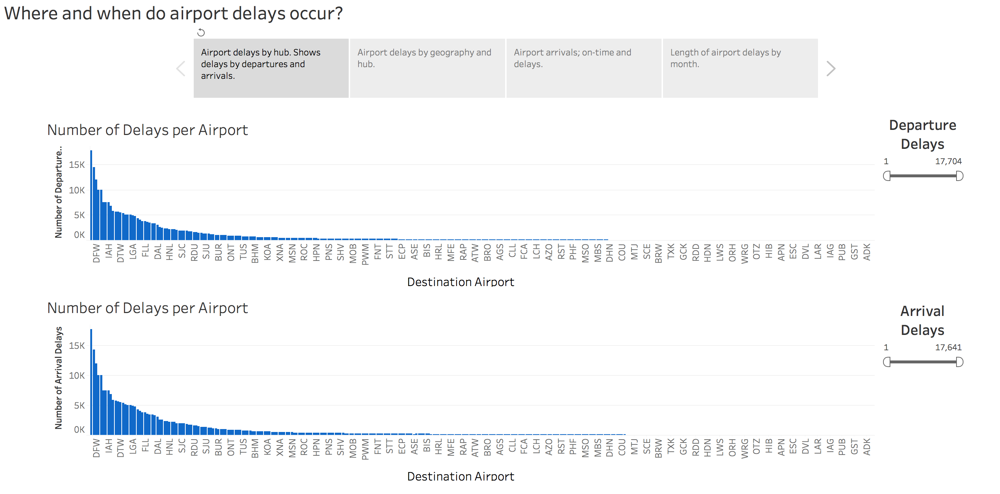
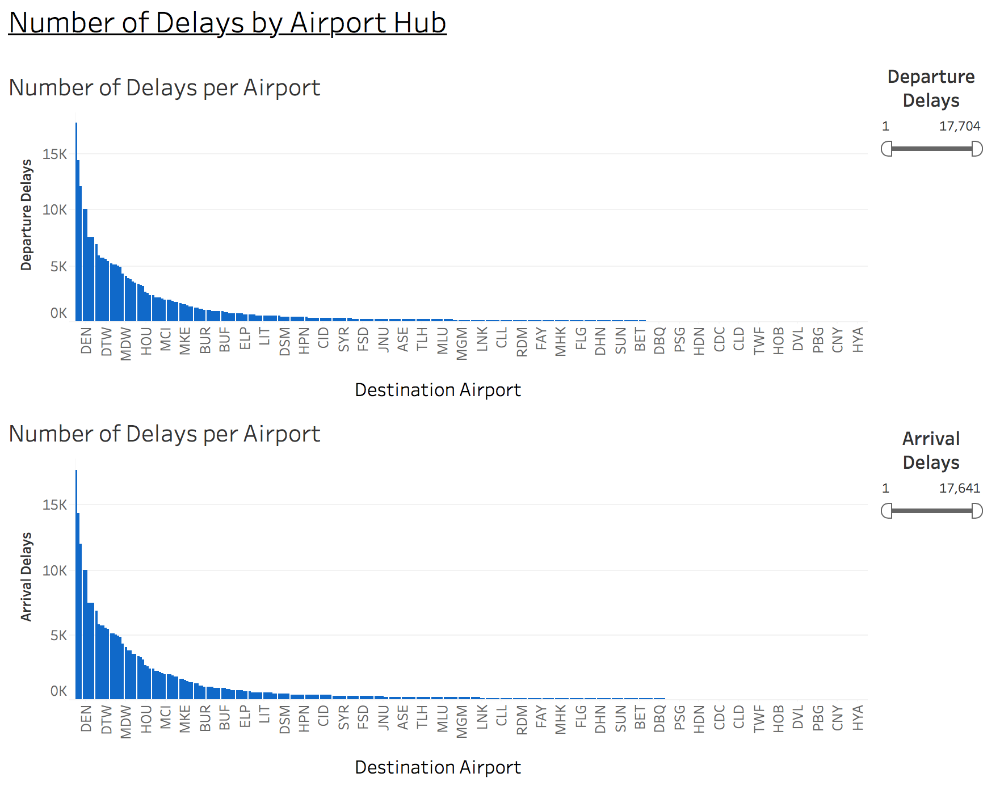
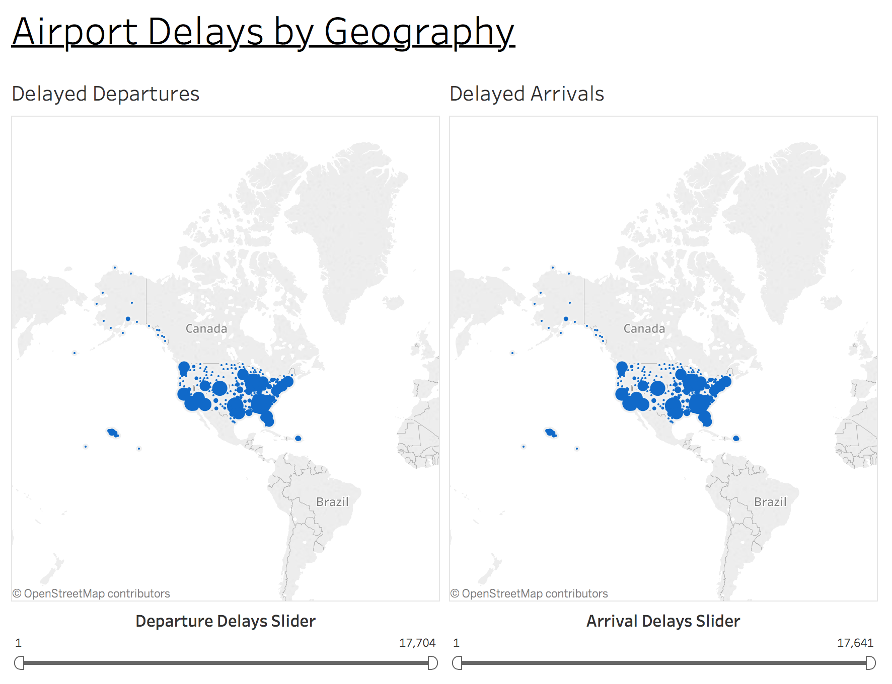
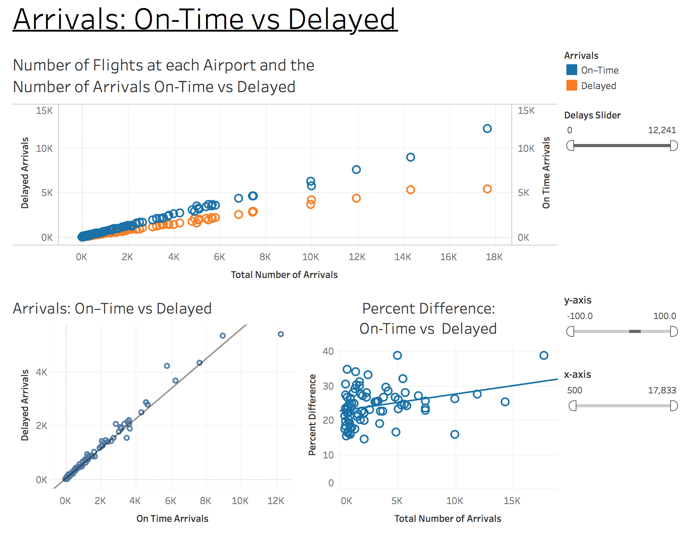
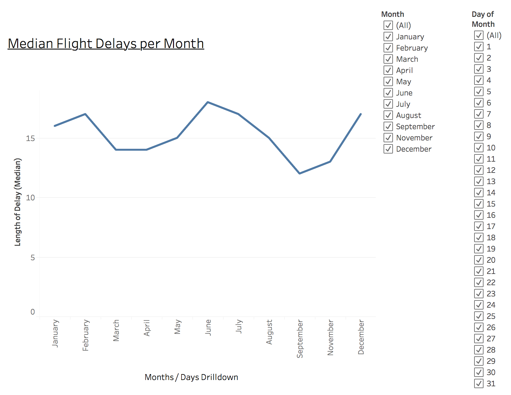
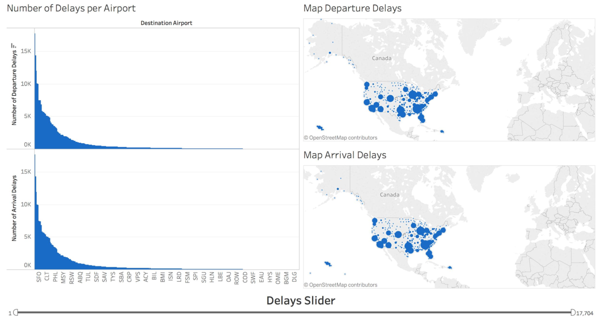
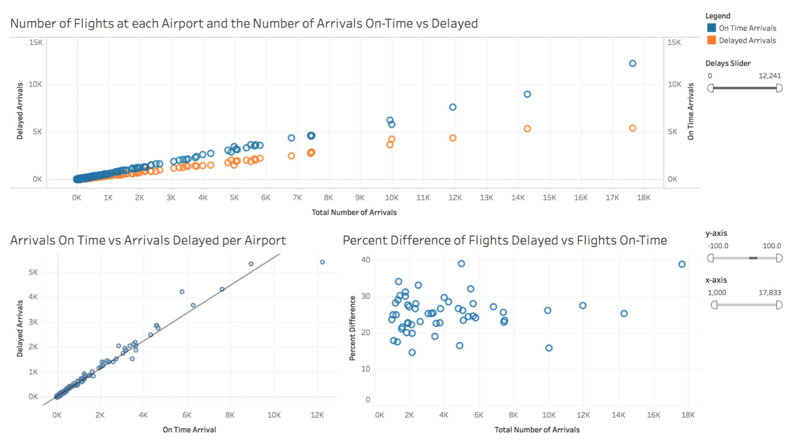
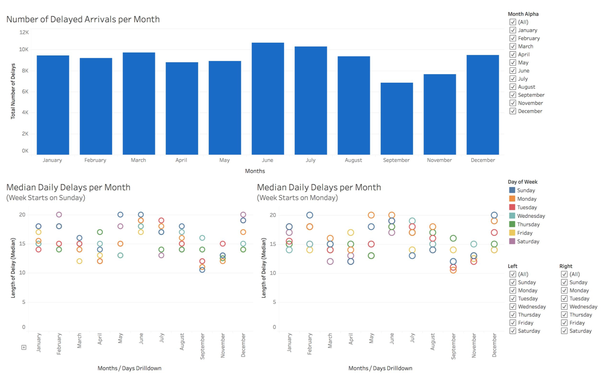

# Flight Delays

### by Travis Gillespie

## Table of Contents
- [Summary](#summary)
- [Design](#design)
    - [Visualization 1](#visual1)
    - [Visualization 2](#visual2)
    - [Visualization 3](#visual3)
    - [Visualization 4](#visual4)    
- [Feedback](#feedback)
- [Resources](#resources)

<a id='summary'></a>
## Summary

The purpose of this project is to explore a dataset with Tableau and create an explanatory data visualisation that clearly communicates my findings. The flight delays data for this project comes from a Kaggle dataset (#resources), which tracks performance of on-time US domestic flights operated by large air carriers in 2015. The data can be downloaded from Kaggle [<sup>1</sup>](#resources), or found in _data.zip_. The flight delays data set was used to create the following [Tableau story](https://public.tableau.com/views/flight_delays/Story1?:embed=y&:display_count=yes&publish=yes):

[](https://public.tableau.com/views/flight_delays/Story1?:embed=y&:display_count=yes&publish=yes")


-----

<a id='design'></a>
## Design

<a id='visual1'></a>
### Visual 1

This first dashboard displays the [number of delays](https://public.tableau.com/views/flight_delays/Dashboard_DelaysDeparturesvsArrivals?:embed=y&:display_count=yes") using bar graphs (both for arrivals and departures). I chose a bar graph because the data is comparing the total count of delays per airport.

[](https://public.tableau.com/views/flight_delays/Dashboard_DelaysDeparturesvsArrivals?:embed=y&:display_count=yes")

-----

<a id='visual2'></a>
### Visual 2

This second dashboard displays the [number of delays](https://public.tableau.com/profile/travis.gillespie#!/vizhome/flight_delays/Dashboard_AirportDelays "Airport Delays Dashboard") using a map (both for arrivals and departures). I used a map because the data contains information regarding geographical locations.

One key finding displayed on both graphs is the busiest hubs have more delays throughout the year (e.g. ATL, ORD, DFW, DEN, and LAX). This link provides a list of the busiest airports in the United States.
Use the slider at the bottom of this dashboard to scrub through the data. Colors were selected based on suggestions in the blog, 5 tips on designing colorblind friendly visualizations. [<sup>2</sup>](#resources)

[](https://public.tableau.com/profile/travis.gillespie#!/vizhome/flight_delays/Dashboard_AirportDelays "Airport Delays Dashboard")

-----

<a id='visual3'></a>
### Visual 3

This third dashboard compares the [number of delayed and on-time arrivals](https://public.tableau.com/profile/travis.gillespie#!/vizhome/flight_delays/Dashboard_DestinationDelays "On-Time vs Delayed"). The following graphs display my initial findings. I chose scatter plots for this section because each graph displays the relationship between two variables.

[](https://public.tableau.com/profile/travis.gillespie#!/vizhome/flight_delays/Dashboard_DestinationDelays "On-Time vs Delayed")

* Top: As the total number of arrivals (per airport) increase, the number of delayed and on-time arrivals increase. Notice the spread between delayed and on-time arrivals also increases.

* Bottom Left: An r-square value of 0.98 suggests there is a strong correlation between the number of delayed and on-time arrivals.

* Bottom Right: Although the spread increases (shown in top graph) as the total number of arrivals increase, the percent difference stays within a 15-40% range for busy hubs; suggesting busier airports are highly organized and can manage greater traffic loads.


-----

<a id='visual4'></a>
### Visual 4

The fourth dashboard displays the [median length of delays per month](https://public.tableau.com/profile/travis.gillespie#!/vizhome/flight_delays/Dashboard_DelaysbyMonth "Delays per Month"). I chose a line graph to display changes over time.

Users can also drill-down to view the median length of daily delays per month. For example, the monthly view shows June having the highest median delays. After drilling down into a daily view per month, we can see that the highest median delay values fall within other months (outside of June). In fact, the 18th of July has a median delay value of 30, while the 18th of June (date of highest median delay in June) has a median delay of 29.

It would be interesting to gather data over multiple years to look for cyclical trends, such as higher rates of delays at the end of December and beginning of January. Did this only occur during 2015, or are the higher median delay values due to higher rates of travel during the holidays?

[](https://public.tableau.com/profile/travis.gillespie#!/vizhome/flight_delays/Dashboard_DelaysbyMonth "Delays per Month")

-----

<a id='feedback'></a>
### Feedback

The following feedback refrences the visuals from my [original sketches](./originalSketches/sketch1.pdf), which can be found in the folder labeled originalSketches.

#### <span style="color:darkblue">The following reference _visual 1_ and _visual 2_ above, plus _Dashboard 1_ in my original sketch:</span>


<span style="color:blue">• *The bar charts aren't working. There should be the same number of bars and labels. Every bar should be aligned with a label.*</span>

```I originally had two bar charts in one Tableau worksheet. After the feed back, I moved one of the bar graphs to a second worksheet. This allowed me to place labels under each bar within both bar graphs. Then I placed both worksheets in one dashboard, and added a textbox below each graph to label both x-axes.```

<span style="color:blue">• *When you have data that can be directly linked to a geographical location, almost always, a map will be a better choice.*</span>

```I created a second set of worksheets that used each airport's longitude and latitude to place them on a map.```

<span style="color:blue">• *You should either remove the bar charts or make sure that you correctly display the data in them.*</span>

```I created a second set of worksheets that used each airport's longitude and latitude to place them on a map.```

-----

#### <span style="color:darkblue">The following reference _visual 3_ above, and _Dashboard 2_ in my original sketch:</span>


<span style="color:blue">• *In the second link, there should be a title for the whole dashboard.*

```I created a title for the dashboard. Then placed the dashboard in a story.```

#### <span style="color:darkblue">The following reference _visual 4_ above, and _Dashboard 3_ in my original sketch:</span>


<span style="color:blue">• *In the third link, all the plots need to be modified. When you have time series, you must use line charts. Remember, bar charts are used to compare categorical variables and scatterplots to see the relationship between 2 variables. Please use line charts next time and use month names as labels.*</span>

```I removed all graphs and started from scratch. I changed the bar charts to a line graph as suggested, to compare the length of delays over time (by month). I also created a drill down path. By expanding the month, you can drill down a layer to view the individual days within each month. The filter is another hadny feature that allows you to select desired months and days. I watched a youtube video to help refresh me on drill hierachal drilldowns in Tableau.``` [<sup>3</sup>](#resources)


-----

<a id='resources'></a>
### Resources

1. [Flight Delays](https://www.kaggle.com/usdot/flight-delays/data "Flight Delays Data")

* [Coloring for Colorblindness](https://www.tableau.com/about/blog/2016/4/examining-data-viz-rules-dont-use-red-green-together-53463)

* [Tableau Drilldowns](https://youtu.be/K7VJpXvBfIY)
