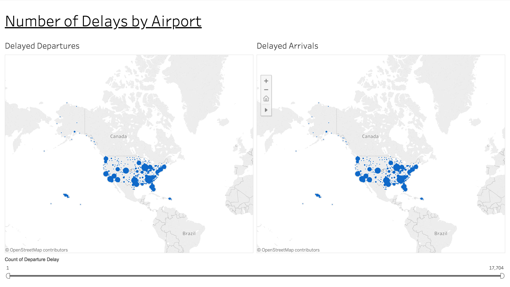

# Project Overview

This project allowed me to run an A/B test on a factitious e-commerce website to understand if the company should implement their new page, keep the old page, or perhaps run the experiment longer before making a decision. I analyzed the <i>ab_data.csv</i> and _countries.csv_ datasets using Python libraries: Pandas, NumPy, Matplotlib, and SciPy.

In this project, I analyzed the [No-Show Appointments](https://d17h27t6h515a5.cloudfront.net/topher/2017/October/59dd2e9a_noshowappointments-kagglev2-may-2016/noshowappointments-kagglev2-may-2016.csv) dataset using the Python libraries NumPy, pandas, and Matplotlib. This project allowed me to investigate problems in the _No Show Appointments_ dataset, wrangle the data into a familiar format, and communicate the results of my analysis.

1:
[Airport Delays Dashboard](https://public.tableau.com/profile/travis.gillespie#!/vizhome/flight_delays/Dashboard_AirportDelays "Airport Delays Dashboard")

embed: 
<noscript></noscript><object class='tableauViz'  style='display:none;'><param name='host_url' value='https%3A%2F%2Fpublic.tableau.com%2F' /> <param name='embed_code_version' value='3' /> <param name='site_root' value='' /><param name='name' value='flight_delays&#47;Dashboard_AirportDelays' /><param name='tabs' value='no' /><param name='toolbar' value='yes' /><param name='static_image' value='https:&#47;&#47;public.tableau.com&#47;static&#47;images&#47;fl&#47;flight_delays&#47;Dashboard_AirportDelays&#47;1.png' /> <param name='animate_transition' value='yes' /><param name='display_static_image' value='yes' /><param name='display_spinner' value='yes' /><param name='display_overlay' value='yes' /><param name='display_count' value='yes' /></object>
                

2: https://public.tableau.com/profile/travis.gillespie#!/vizhome/flight_delays/Dashboard_DestinationDelays

3: https://public.tableau.com/profile/travis.gillespie#!/vizhome/flight_delays/Dashboard_DelaysbyMonth
