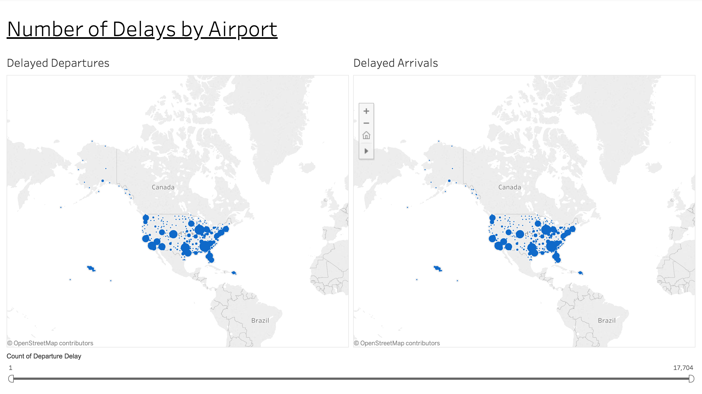
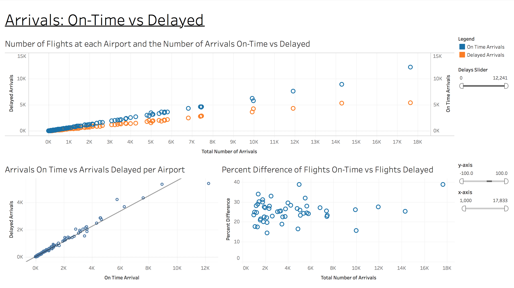
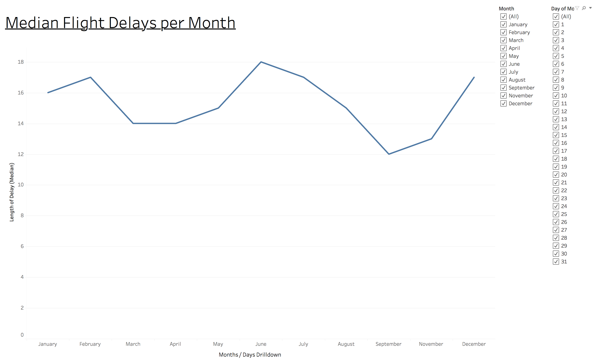

# Project Overview

I created three Tableau dashboards for this project. The [Flight Delays](https://www.kaggle.com/usdot/flight-delays/data "Flight Delays Data") data for this project comes from a Kaggle dataset. It tracks performance of on-time US domestic flights operated by large air carriers in 2015. The data can be downloaded from Kaggle, or found in this project's [data](https://github.com/travisgillespie/jupyterNotebook/tree/master/flightDelays/data "data") folder.

1: This first dashboard displays the [number of delays](https://public.tableau.com/profile/travis.gillespie#!/vizhome/flight_delays/Dashboard_AirportDelays "Airport Delays Dashboard") (both for arrivals and departures). One key finding displayed on both graphs is the busiest hubs have more delays throughout the year (e.g. ATL, ORD, DFW, DEN, and LAX). This link provides a list of the busiest airports in the United States.
Use the slider at the bottom of this dashboard to scrub through the data.
Colors were selected based on suggestions in the blog, 5 tips on designing colorblind friendly visualizations.

2: This second dashboard compares the [number of delayed and on-time arrivals](https://public.tableau.com/profile/travis.gillespie#!/vizhome/flight_delays/Dashboard_DestinationDelays "On-Time vs Delayed"). The following graphs display my initial findings.

* Top: As the total number of arrivals (per airport) increase, the number of delayed and on-time arrivals increase. Notice the spread between delayed and on-time arrivals also increases.

* Bottom Left: An r-square value of 0.98 suggests there is a strong correlation between the number of delayed and on-time arrivals.

* Bottom Right: Although the spread increases (shown in top graph) as the total number of arrivals increase, the percent difference stays within a 15-40% range for busy hubs; suggesting busier airports are highly organized and can manage greater traffic loads.

3: The third dashboard displays the [median length of delays per month](https://public.tableau.com/profile/travis.gillespie#!/vizhome/flight_delays/Dashboard_DelaysbyMonth "Delays per Month"). Users can also drill-down to view the median length of daily delays per month. For example, the monthly view shows June having the highest median delays. After drilling down into a daily view per month, we can see that the highest median delay values fall within other months (outside of June). In fact, the 18th of July has a median delay value of 30, while the 18th of June (date of highest median delay in June) has a median delay of 29.

It would be interesting to gather data over multiple years to look for cyclical trends, such as higher rates of delays at the end of December and beginning of January. Did this only occur during 2015, or are the higher median delay values due to higher rates of travel during the holidays?

