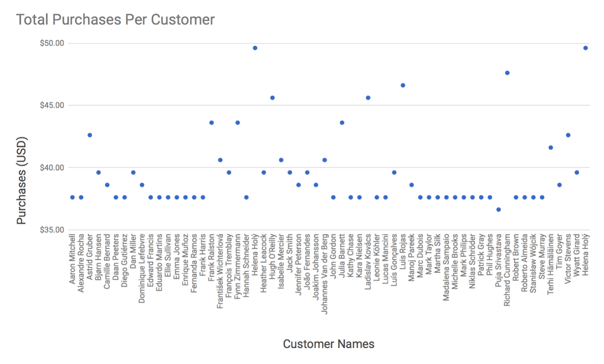
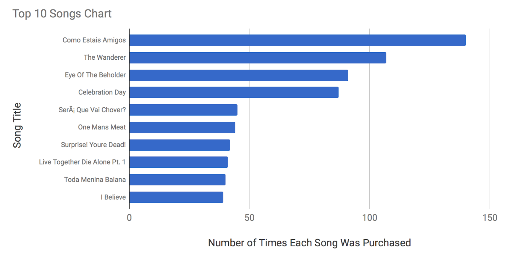
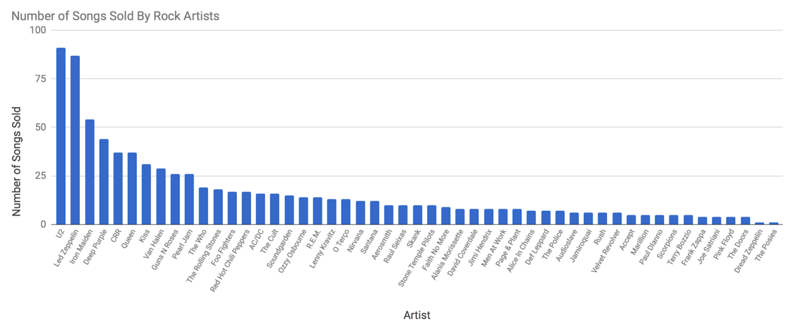
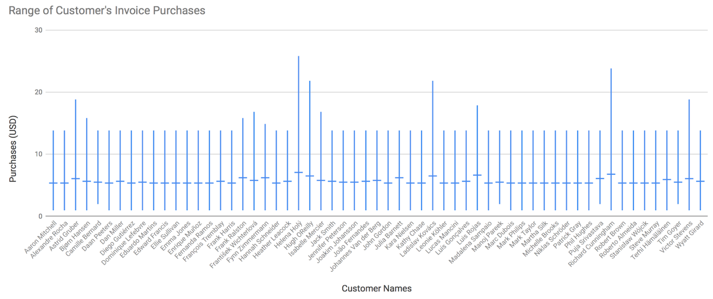

# Project Overview

This exploratory dataset allowed me to query the Chinook Database. A factitious company which holds information about a music store. For this project, I assisted the Chinook team with understanding the media in their store, their customers and employees, and their invoice information. The schema for the Chinook Database is provided below, followed by four questions with the SQL queries that were used to answer them.


## 1: Who Purchased the Least Amount of Music?



This data could be useful to companies running an ads campaign to target top clients. Since the chart displays all clients, a company can easily see who the lowest paying clients are, remove them from their campaigns list and allocate that money toward clients who have made more purchases.

```SQL
SELECT c.FirstName || " " || c.LastName AS "Name", SUM(il.Quantity * il.UnitPrice) AS "Total Purchases"
From Invoice AS i
Join InvoiceLine AS il
  ON i.InvoiceId = il.InvoiceId
JOIN Customer AS c
  ON i.CustomerId = c.CustomerId
GROUP BY c.Email
ORDER BY "Total Purchases";
```


## 2: What are the Most Popular Songs?



This graph lists the top 10 most purchased songs, and the number of times the song was purchased. Whether looking at “most-or-least popular”, it is important to note that some song’s sales reports will have a lower volume due to their release date (i.e. a new song vs old song). In that case, it might be more appropriate to use the term “most purchased” rather than “most popular”.

```SQL
SELECT a.Name AS "Artist", t.Name AS Song, SUM(il.Quantity) AS Sum
FROM  InvoiceLine AS il
JOIN Track AS t
  ON il.TrackId = t.TrackId
JOIN Album AS al
  ON t.AlbumId = al.AlbumId
JOIN Artist AS A  
  ON al.ArtistId = a.ArtistId
GROUP BY a.Name
ORDER BY Sum DESC
LIMIT 10;
```


## 3: How Many Songs Did Each Rock Artist Sell?



The bar graph displays the number of songs each rock artist has sold. This information could help a company see who their top performers are in order to run special promotion, or inform clients the next time that artist is playing a concert near their city.


```SQL
SELECT a.Name AS "Artist", SUM(il.Quantity) AS "Number of Songs Sold"
FROM  InvoiceLine AS il
JOIN Track AS t
  ON il.TrackId = t.TrackId
JOIN Album AS al
  ON t.AlbumId = al.AlbumId
JOIN Artist AS a  
  ON al.ArtistId = a.ArtistId
WHERE t.GenreId = 1
GROUP BY a.Name
ORDER BY SUM(il.Quantity) DESC
```


## 4: What is the Range of Customer's Invoice Purchases?



Using the Invoices table, I was able to aggregate the minimum, maximum, and average amount of each client’s purchases. Notice the graph displays this range.

```SQL
SELECT MIN(i.Total) AS "MIN", AVG(i.Total) AS "AVG", MAX(i.Total) AS "MAX", c.FirstName || " " || c.LastName AS "Name", c.Email, c.Phone
FROM Invoice AS i
JOIN Customer AS c
  ON i.CustomerId = c.CustomerId
GROUP BY i.CustomerId
```
